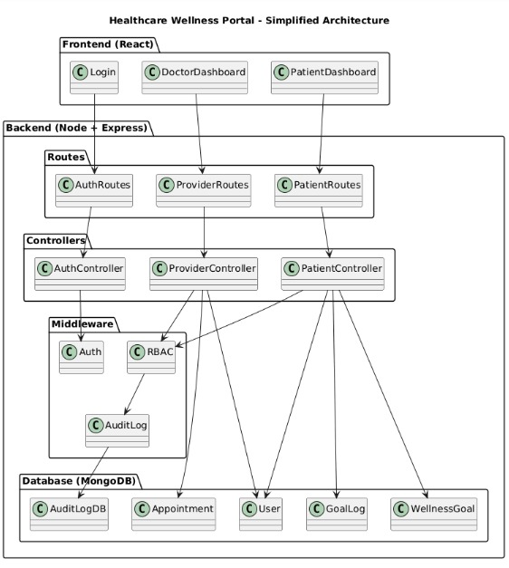

# MVP Architecture - Healthcare Wellness Portal

## Project Structure



```
healthcare-portal/
├── backend/
│   ├── src/
│   │   ├── controllers/
│   │   │   ├── authController.js
│   │   │   ├── patientController.js
│   │   │   ├── providerController.js
│   │   │   └── publicController.js
│   │   ├── middleware/
│   │   │   ├── auth.js
│   │   │   ├── rbac.js
│   │   │   └── auditLog.js
│   │   ├── models/
│   │   │   ├── User.js
│   │   │   ├── Appointment.js
│   │   │   ├── WellnessGoal.js
│   │   │   ├── GoalLog.js
│   │   │   ├── AuditLog.js
│   │   │   └── DoctorAvailability.js
│   │   ├── routes/
│   │   │   ├── auth.js
│   │   │   ├── patient.js
│   │   │   ├── provider.js
│   │   │   └── public.js
│   │   ├── seeds/
│   │   │   └── doctors.js       # Pre-seed 5 doctors
│   │   └── server.js
│   └── package.json
│
└── frontend/
    ├── src/
    │   ├── components/
    │   │   ├── Auth/
    │   │   │   ├── Login.jsx
    │   │   │   └── Register.jsx      # With consent checkbox
    │   │   ├── Patient/
    │   │   │   ├── Dashboard.jsx
    │   │   │   ├── GoalTracker.jsx   # Log daily progress
│   │   │   │   ├── CreateGoal.jsx    # Patient creates own goals
│   │   │   │   ├── BookAppointment.jsx
│   │   │   │   └── Profile.jsx
│   │   │   ├── Doctor/
│   │   │   │   ├── Dashboard.jsx
│   │   │   │   └── PatientList.jsx   # View patients + their goals
    │   │   └── Public/
    │   │       └── HealthInfo.jsx    # Static health info + privacy
    │   ├── context/
    │   │   └── AuthContext.jsx
    │   └── App.jsx
    └── package.json
```

## 📊 Database ER Diagram – Healthcare Wellness Portal

```dbml
Table User {
  user_id int [pk, increment]
  email varchar [unique, not null]
  password_hashed varchar [not null]
  role varchar
  name varchar
  allergies text
  medications text
  specialty varchar
  consent_given boolean
  consent_date datetime
  created_at datetime
}

Table DoctorAvailability {
  availability_id int [pk, increment]
  doctor_id int [ref: > User.user_id]
  day_of_week int
  slot_time varchar
}

Table Appointment {
  appointment_id int [pk, increment]
  patient_id int [ref: > User.user_id]
  doctor_id int [ref: > User.user_id]
  date date
  time varchar
  status varchar
}

Table WellnessGoal {
  goal_id int [pk, increment]
  patient_id int [ref: > User.user_id]
  type varchar
  title varchar
  target_value int
  unit varchar
  status varchar
  created_at datetime
}

Table GoalLog {
  log_id int [pk, increment]
  patient_id int [ref: > User.user_id]
  goal_id int [ref: > WellnessGoal.goal_id]
  date date
  value int
  created_at datetime
}

Table AuditLog {
  audit_id int [pk, increment]
  user_id int [ref: > User.user_id]
  action varchar
  resource_id varchar
  timestamp datetime
  ip_address varchar
}

```

## API Endpoints

### Auth (Public)

POST /api/auth/register
Body: { email, password, name, role, consentGiven: true }

POST /api/auth/login
Response: { token, user }
```

### Patient (JWT + role:patient)
```
GET  /api/patients/profile
PUT  /api/patients/profile
Body: { name, allergies, medications }

GET  /api/patients/appointments
GET  /api/patients/doctors              # List available doctors
POST /api/patients/appointments
Body: { doctorId, date, time }

GET  /api/patients/goals                # My goals
POST /api/patients/goals                # Create new goal
Body: { type, title, target, unit }     # e.g., { type: "steps", title: "Daily steps", target: 10000, unit: "steps" }
PUT  /api/patients/goals/:id            # Update goal
DELETE /api/patients/goals/:id          # Delete goal
GET  /api/patients/goals/:id/logs       # My progress logs
POST /api/patients/goals/:id/log        # Log daily progress
Body: { value }                         # e.g., { value: 8500 } for steps
```

### Provider (JWT + role:doctor)
```
GET  /api/providers/patients                  # Assigned patients
GET  /api/providers/patients/:id              # Patient details + compliance
GET  /api/providers/patients/:id/goals        # View patient goals (read-only)

GET  /api/providers/availability
PUT  /api/providers/availability
Body: { slots: ["09:00", "10:00", ...] }
```

### Public (No auth)
```
GET  /api/public/health-info
GET  /api/public/privacy-policy
```

## Feature Mapping

| Feature | Frontend | Backend | Model |
|---------|----------|---------|-------|
| 1. Auth + Consent | Register.jsx | authController | User |
| 2. Patient Dashboard | Dashboard.jsx | patientController | Appointment, Goal |
| 3. Profile Management | Profile.jsx | patientController | User |
| 4. Doctor Dashboard | Dashboard.jsx | providerController | User, Goal (view) |
| 5. Health Info Page | HealthInfo.jsx | publicController | Static |
| 6. Goal Tracker + Create | GoalTracker.jsx, CreateGoal.jsx | patientController | WellnessGoal, GoalLog |
| 7. Audit Logging | - | auditLog middleware | AuditLog |

## Request Flows

### Patient Logs Daily Steps
```
Browser → POST /api/patients/goals/:id/log { value: 8500 }
                    ↓
        auth.js → rbac.js → auditLog.js
                    ↓
        patientController.logGoalProgress()
        - Verify goal belongs to patient
        - Create GoalLog entry
        - Update goal progress percentage
                    ↓
        ← { success: true, progress: 85 }
```

### Doctor Views Patient Compliance (Read-Only)
```
Browser → GET /api/providers/patients/:id
                    ↓
        auth.js → rbac.js → auditLog.js
                    ↓
        providerController.getPatientDetail()
        - Verify patient is assigned
        - Fetch patient-created goals with progress
        - Calculate compliance status
                    ↓
        ← {
            patient: { name, allergies },
            goals: [
              { title: "10k steps", progress: 85, status: "Goal Met" },
              { title: "Annual checkup", progress: 0, status: "Missed" }
            ],
            compliance: "Partial"
          }
```

### Patient Creates Goal
```
Browser → POST /api/patients/goals { type: "steps", title: "Daily walk", target: 10000, unit: "steps" }
                    ↓
        auth.js → rbac.js → auditLog.js
                    ↓
        patientController.createGoal()
        - Create WellnessGoal with patientId from JWT
                    ↓
        ← { _id: "...", title: "Daily walk", target: 10000, status: "active" }
```

## Pre-Seeded Data (5 Doctors)

```javascript
// seeds/doctors.js
const doctors = [
  { name: "Dr. Smith", specialty: "General", slots: ["09:00","10:00","11:00"] },
  { name: "Dr. Patel", specialty: "Cardiology", slots: ["14:00","15:00","16:00"] },
  { name: "Dr. Chen", specialty: "Dermatology", slots: ["09:00","10:00"] },
  { name: "Dr. Wilson", specialty: "Orthopedics", slots: ["11:00","14:00","15:00"] },
  { name: "Dr. Garcia", specialty: "Pediatrics", slots: ["09:00","10:00","11:00","14:00"] }
];
```

## Run Locally

```bash
# Backend
cd backend && npm install
npm run seed    # Seed 5 doctors
npm run dev

# Frontend
cd frontend && npm install
npm start
```
